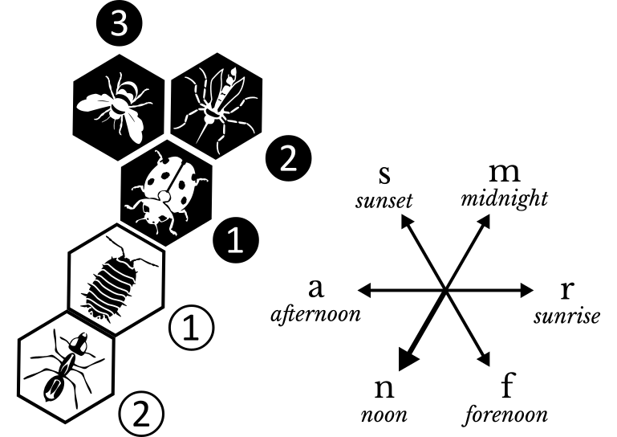

A consistent notation system plays a key role in the practice and study of board games. The direction-based notation for Hive was created to fulfill the following goals:

1. Games that are mirrored, rotated or played with reversed colors all have identical notations.
2. Pieces of the same kind do not need to be tracked to be told apart.
3. Every move has only one notation.
4. Moves are easy to record and replay for human players and computers.

These goals are even more important when studying openings where -- save for transpositions in move order -- this system produces identical notation. This is true regardless of which color moves first, rotations and mirroring.

The sequence of play in these two games is identical. Using the direction-based system, their notation is identical too.

The notation uses directions which are based on the movement of the sun. This choice was made because it both achieves the stated goals, and it also thematically fits the way bees communicate and navigate in nature.

## Notation Examples

The notation identifies the piece being moved and its destination. The destination is notated using either only a direction or a ‘reference piece’ and a direction.

>> Before we go into the details, here are examples of what the notation looks like:
>>
>> -   **Ba** means the Beetle[^details] moves to a destination in the afternoon direction (which could involve climbing up or down).
>> -   **M+Qn** means the Mosquito is placed to a destination on Queen Bee’s noon side.
>> -   **A2×Pm** means the second Soldier Ant moves against opponent’s Pillbug’s midnight side.

This article explains the rules for the notation and includes two example games.

[^details]: More accurately, **B** means the only visible Beetle in the Hive of the player whose turn it is.

# Foundations

## Players and Turns

For notation purposes, “opponent” refers to the other player than the one whose turn it is.

Turns are numbered separately for each player. A passed turn is counted as a turn by that player.

## Pieces

The playing pieces of both colors are notated using capital letters as follows:

{: .w15}
{: .float}

-   **Q**: Queen Bee
-   **B**: Beetle
-   **G**: Grasshopper
-   **S**: Spider
-   **A**: Soldier Ant
-   **M**: Mosquito
-   **L**: Ladybug
-   **P**: Pillbug

## Directions

The six directions in the Hive are named. The names are always assigned in the following order either clockwise or counterclockwise, and notated using lower-case abbreviations:

Clockwise (top), and counterclockwise (bottom) assignment of directions.
{:.float}

-   **n**: noon
-   **a**: afternoon
-   **s**: sunset
-   **m**: midnight
-   **r**: sunrise
-   **f**: forenoon

>> When directions are assigned clockwise, the sun moves as observed in the Northern hemisphere. When counterclockwise, the directions correspond to the sun's movement in the Southern hemisphere.

### Determining the Directions

The first turn by the two players determines noon and midnight directions as follows: The second player’s piece is in the noon direction from the first player’s piece.

The remaining directions are assigned when either player places or moves a piece to a space that is not in the noon or midnight direction from other pieces in the Hive. The clockwise or anticlockwise order of direction is selected so that the new space will be in the afternoon or sunset direction from all the other pieces.

{:.w25}
First player opened with Ladybug, and when the second player placed the Pillbug, she established the noon and midnight directions. Later, Queen Bee was the first to be placed in a different direction, establishing the remaining directions so that it is in an afternoon or sunset direction from other pieces.

Once the directions are established, they stay fixed for the rest of the game, even if the first two pieces were to move.

# Notation

The notation records which piece is being moved (**moved piece**) on a player’s turn and the space where it is being moved to (its **destination**). The notation is based on the positions of pieces at the start of the player’s turn.

## Moved Piece

A “moved piece” is the piece being physically moved.

>> This means that pieces that are being placed into the Hive and opponent’s pieces moved using the Pillbug special ability are also considered “moved pieces.”

The moved piece is notated using the Piece Notation, below.

## Piece Notation

Piece Notation identifies a specific piece as follows:

1.  If the piece belongs to the opponent, the piece notation starts with **×** (multiplication sign, or lower-case letter **x**).
2.  It always contains the abbreviation of the piece. (See **Pieces** above.)
3.  If the piece is not the only one of the same color and kind visible (uncovered) in the Hive,[^placement] it is followed by a number (1, 2 or 3) as assigned to the piece among the identical pieces using the **[counting](#counting)** method (see below).

[^placement]: Note that this means that when placing a piece into the Hive, the numbering part of the notation is not used for that piece.

## Counting

When it is necessary to order or number several pieces, the counting goes from pieces that are located farthest in the noon direction to those in the midnight direction and — if two or more pieces are equally distant — the counting between them goes from forenoon to sunset.

{:.w30}
The chart on the left illustrates the general order of counting. The right example shows how the three Soldier Ants would be numbered in this position.

## Direct Destination

If the destination is next to the moved piece or the moved piece is a Grasshopper using its regular move, the destination is notated using only the abbreviation of the direction of the move. In other cases, use the [referenced destination](#fererenced-destination) below.

>> Note that this means a move with a Soldier Ant to a space next to it is notated using direct destination. It also means that a move with a Mosquito mimicking a Grasshopper is not notated using direct destination.

## Referenced Destination

Referenced destination notates first a ‘target’ next to the destination and then a direction from the target to the destination as follows:

1.  Determine a reference piece (see **[Selecting a Reference](#selecting-a-reference)** below).
2.  The reference piece is notated using the **[Piece Notation](#piece-notation)** (described above).
3.  Direction from the target to the destination is notated as the direction abbreviation.

## Selecting a Reference

To determine the reference piece from the pieces next to the destination, choose the top applicable option based on the following priorities and regardless of the color of the piece. If more than one piece matches the description, select the first one (as described under **[Counting](#counting)** above).

1.  **Queen Bee**, whether it is **uncovered or covered** in a stack.
2.  **Uncovered inherently unique piece.** (Ladybug, Mosquito, or Pillbug.)
3.  **Only visible piece.** (Uncovered piece in the Hive that is the only uncovered one of the same color and kind.)
4.  **Any piece.**

## Special Moves

-   **First Turn:** First placement by each player is notated using only the abbreviation of that piece.
-   **Placements:** When the moved piece is a new piece being placed in the Hive, insert a **+** (plus sign) between the moved piece and the destination notation. If the **+** is followed by **×**, the two symbols are replaced with a __✳&#xFE0E;__ (an eight-spoked star, or asterisk __\*__).
-   **Passed Turn:** Passed turn is notated as “**---**” (m-dash, or two hyphens `--`)

## Canonical Notation

Although many moves could be recorded in an even more abbreviated form, the remaining redundancy was left in the notation on purpose. It makes the notation easy to read and record, and it makes it more resistant to errors.

In non-canonical notations, it is possible to leave out some parts of the notation (piece numbering, reference, or direction) or choose a different reference piece, provided that the notation still describes only one legal turn.

* * *

# Example Games

## Game 1

The following game was transcribed from [2019 Brilliancy Award Game Two](https://www.youtube.com/watch?v=pzMFFKD4eVc "Link to YouTube video of the game") on YouTube. (The game is diagrammed with Northern hemisphere directions, noon pointing up, and black pieces moving first.)

>> Player 1: **Frank Chen**  
>> Player 2: **Joe Schultz**  
>> Date: **September 8, 2019**  
>> Tournament: **2019 BoardSpace.net Online World Championship**

| Turn | Player 1 | Player 2 |
| ----:| -------- | -------- |
|   1. | L        | P        |
|   2. | M+Lm     | A+Pn     |
|   3. | Q+Ls     | Q+Pa     |
|   4. | P+Qa     |          |

{:.w10}
{:.float}

The diagram shows the position after the first player’s fourth turn.
{: style="clear:both;"}

| Turn | Player 1 | Player 2 |
| ----:| -------- | -------- |
|   4. |          | A×Mm     |
|   5. | A+Pa     | A+Qa     |
|   6. | A×A1a    | M+Qf     |
|   7. | B+Lr     | A+Mr     |

{:.float}

Shaded pieces indicate transition moves that occurred within the numbered sequence.
{: style="clear:both;"}

| Turn | Player 1 | Player 2 |
| ----:| -------- | -------- |
|   8. | Ba       | MQs      |
|   9. | Qs       | A2×Qs    |
|  10. | Bn       | B+A2m    |

{:.w15}
{:.float}

 {: style="clear:both;"}

| Turn | Player 1 | Player 2 |
| ----:| -------- | -------- |
|  11. | A+Lr     | Bf       |
|  12. | A2×Qn    | Bn       |
|  13. | Ba       | G✳&#xFE0E;Qm    |

{:.w15}
{:.float}

 {: style="clear:both;"}

| Turn | Player 1 | Player 2 |
| ----:| -------- | -------- |
|  14. | A+Lr     | Gn       |
|  15. | A1×A2m   | S+Pf     |
|  16. | A2×A3m   | S+A2a    |
|  17. | S+A2r    | B+S2n    |

{:.w18}
{:.float}

 {: style="clear:both;"}

| Turn | Player 1 | Player 2 |
| ----:| -------- | -------- |
|  18. | A1×B1a   | Gm       |
|  19. | A2×A1a   | L+S2m    |

{:.w18}
{:.float}

 {: style="clear:both;"}

| Turn | Player 1 | Player 2 |
| ----:| -------- | -------- |
|  20. | A2×Qn    | G+S1n    |
|  21. | G+A3m    | L×Qf     |
|  22. | ×Mr      |          |

{:.w18}
{:.float}

Numbers above 20 in the diagram omit the first digit: ① means 21; ② means 22.
{: style="clear:both;"}

| Turn | Player 1 | Player 2 |
| ----:| -------- | -------- |
|  22. |          | B2n      |
|  23. | L×Qf     | Pr       |
|  24. | A1×B2a   | G1m      |

{:.w20}
{:.float}

 {: style="clear:both;"}

| Turn | Player 1 | Player 2 |
| ----:| -------- | -------- |
|  25. | L×Pr     | S1s      |
|  26. | Bm       | G1s      |
|  27. | Bs       | ×LPs     |

{:.w20}
{:.float}

 {: style="clear:both;"}

| Turn | Player 1 | Player 2 |
| ----:| -------- | -------- |
|  28. | M×Qf     | M×Qa     |

## Second Example

This example was transcribed from [2019 Brilliancy Award Game One](https://www.youtube.com/watch?v=-g3kqdYoaNE "Link to YouTube video of the game") on YouTube.

>> Player 1: **Povilas Simonis**  
>> Player 2: **Christian Galeas**  
>> Date: **May 12, 2019**  
>> Tournament: **2019 BoardSpace.net Online World Championship**

| Turn | Player 1 | Player 2 |
| ----:| -------- | -------- |
|   1. | L        | L        |
|   2. | A+Lm     | M+Ln     |
|   3. | M+As     | Q+Mr     |
|   4. | Q+Lr     | A+Ms     |
|   5. | M×Qr     | A×As     |
|   6. | B+Mf     | P+Qn     |
|   7. | Bs       | A+Pa     |
|   8. | P+Qr     | A+Ms     |
|   9. | A+Pf     | A2×A1f   |
|  10. | Ba       | Mr       |
|  11. | B+Qf     | B+Qa     |
|  12. | Mn       | Bm       |
|  13. | S+Mf     | S+Pn     |
|  14. | S×Qr     | ×MQa     |
|  15. | Bn       | Bn       |
|  16. | A+Pr     | A1×A3m   |
|  17. | G+Qm     | S×Bf     |
|  18. | Ba       | B+Pa     |
|  19. | Bn       | B1r      |
|  20. | QPm      | A3f      |
|  21. | G+Pn     | LB2a     |
|  22. | G+Lr     | B2r      |
|  23. | G3n      | B2m      |
|  24. | G1a      | B2s      |
|  25. | S+Qa     | Mr       |
|  26. | G3f      | Mm       |
|  27. | Bf       |          |

* * *

>> ## Why This Article
>>
>> In 2019, I played the Hive game with my children remotely and we used the directions concept to communicate the moves. Although I notated the two example games given above, I haven’t had time until now to formally write down the notation principles.
