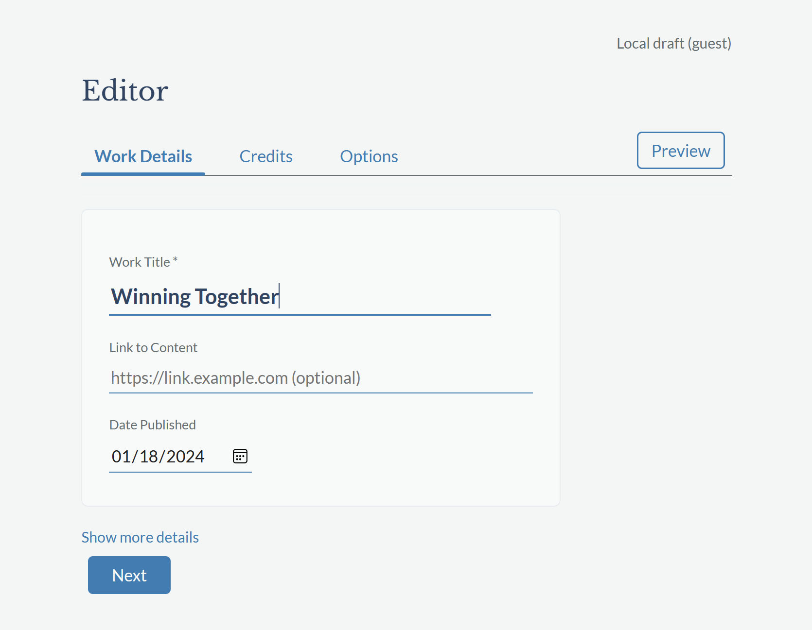
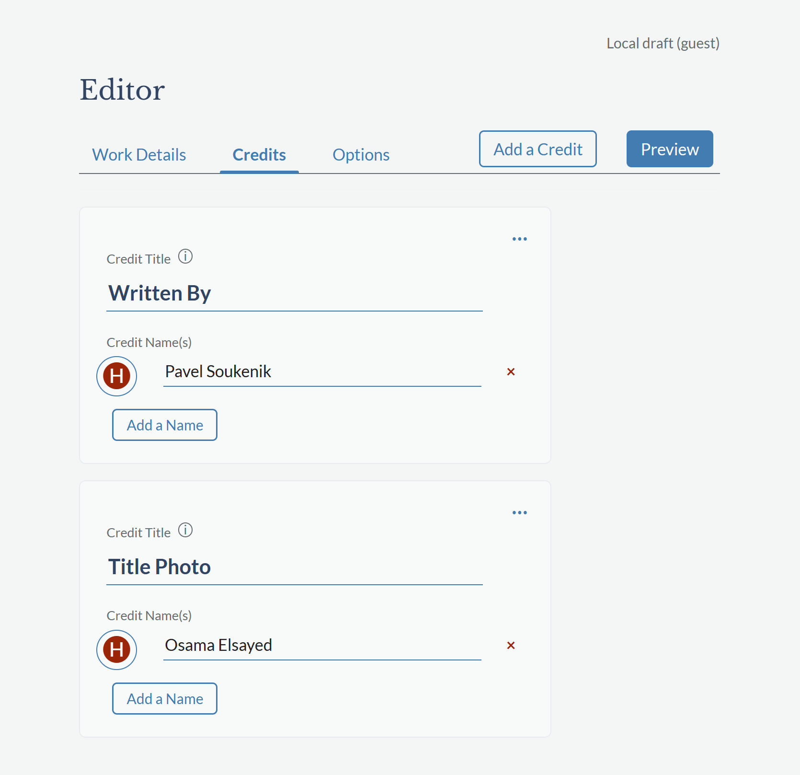
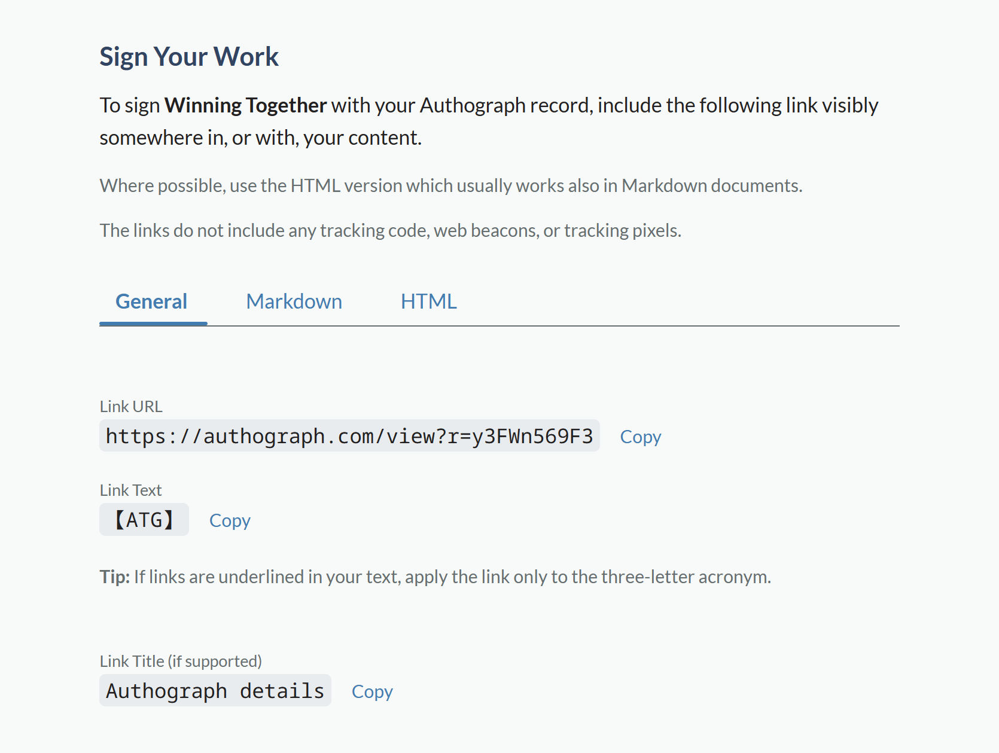

<a href="https://authograph.com/view?r=TBcbBKbUCu" title="Authograph details" style="display: inline-block; text-decoration: none; user-select: none; border: 1.5px solid currentcolor; padding: 0 .4em; margin: 0 .3em;">CHC</a> As readers, viewers, and listeners, we naturally like to know where the content we are consuming came from. When reading an article, we would expect it to readily answer some questions: *Who* wrote it, and *when*? While the matter of *where* is less relevant today, in its place, a bigger question arises: *How* was it created? Was AI involved, and if so, in which areas? Was the content reviewed, and by whom?

Knowing these things feels like a basic right. When I look up an article and do not see its publication date or its sources, I feel disappointed. I am more likely to stay and engage with content which shows the context of its creation. Transparency builds trust, and I believe this is now more important than ever.

While we have useful conventions to list the date, place, author, and even copyright status, there is no established way to indicate the *how* behind the work. This led me to create **Authograph** – an authorship label that can be read at a glance and created by anyone in a matter of a minute.

## The Challenge With Unclear Authorship

My thinking about the “reader’s rights” to authorship information and about what was needed in the Authograph service were further strengthened by two experiences:

I would often read an article or a post, and feel like the content was produced with the aid of generative AI. I also listened to some collaborative music projects that my son enjoys and contributes to, and felt the information about who did what and based on what sources was difficult to convey.

While there are tools that can detect AI content and there are several formal citation styles, they also have their drawbacks (which is why I rarely go and test articles for AI use or see citations outside of academic writing). 

In most contexts, nobody is policing us to credit authorship. We do it because it is ethical and respectful to other authors and our audiences. As audience members, our access to this information goes hand in hand with the ease with which we, as creators, can credit contributors and clarify AI involvement.

##  Inspired by What Works

There were three examples of communicating details about creative works that struck me as particularly effective and inspired Authograph:

1. The labels on audio CDs such as AAD that tell you at a glance whether the music was recorded, mixed, and mastered in analog&nbsp;(A) or digital&nbsp;(D) format. An Authograph label tells you how the work was conceived, produced, and refined, and the abbreviations are **H**&nbsp;(human), **A**&nbsp;(AI), and **C**&nbsp;(collaborative).
2. The way the label is applied was inspired by Creative Commons which allows creators to select an appropriate license, such as CC&nbsp;BY&nbsp;4.0, and include this label as a link in their work.
3. For listing the contributions, the inspiration came from movie credits, which are a simple and effective way to show who did what, while giving people the flexibility to use titles and descriptions that best fit their projects.

Even though Authograph does more than this, it lets users focus just on the level of detail they need. 

## How Authograph Enhances What You Do

Should *you* use the Authograph label? And would not this be just another platform you need to sign up for? To answer this, consider an example that is the opposite of what we have discussed: You write an article on your own, without collaborators or use of AI. Maybe you use a picture by someone else, so you put their name in a caption below it. Does an Authograph label -- HHH in this case -- bring value?

I believe it does. First, other people do not know that you did not use AI, and the label clearly communicates that. Second, by signing your work with the Authograph link, you certify its accuracy with a public record. And third, it enhances your credibility as someone who promotes transparency and creative ethics.

When the origin is collaborative, such as when you provide AI with reference materials and prompts to write a how-to article and then someone reviews it for accuracy, the label is highly informative. A label like CAH lets people immediately know the ideas were developed in a human-AI collaboration, the content was created by AI, and that there was a human review. They can also open the record for more details.

In all cases, the benefits are immediate clarity of authorship; promoting ethics and accountability (e.g. the review was indeed done); and a reputation for responsible use of AI. Together, these build trust between you and your audience and allow your readers to get more value from your content.

## Sign Your First Authograph

Authograph can be applied to all types of content – form an Instagram post, a short story, or music published on YouTube, through sports and news report, to investment analyses or medical test results. It does not require you to create an account or pay a subscription and can be created in a minute or two.

Signing your work with Authograph is quick and seamless. It was built as a service that allows you to keep the tools and platforms you are already using. Creating and using Authograph records is free.

Try creating one for a something you already published by following these simple steps and see if you like it:

### 1. Enter the title and credits for your work

* Select [Authograph Your Work](https://authograph.com/editor) on the Authograph home page.

* On the screen (as shown below), fill in the title of your work or post.

  

* Then click **Next** and fill in a Credit Title, such as “Author” or “Written By”, and your name:

  

  Use the buttons Add a Credit and Add a Name to add more contributions as needed and then click **Preview**.

  (You can also change the type of the contributors using the icons to the left of the names.) 

### 2. Publish the record

* If you are happy with the result, click the **Publish** button, or go back to the editor to make changes.
* Enter your email and click **Confirm & Publish** to attest the accuracy of the information and confirm your identity.
* On the next screen, enter the code from the verification email.

### 3. Sign your content with the Authograph link

* Copy the link to your Authograph record and place it in your post or content.

  

Congratulations, you just created your first Authograph. (The result from my example can be seen at the top of [this article](/winning-together).)

You can create the records even faster when you register, which is also free. This allows you to use your previous records as templates, publish without additional verification emails, and to amend your existing records.

There are more things you can do that are available through the menus of each credit and on the Options tab in the editor, but these steps are all you need to publish an Authograph record.

## Show the World How It's Made

By embracing and promoting transparency in authorship, we can contribute to and benefit from a world where content is enjoyed with the trust and knowledge of how it was created – whether it is the result of a vision by a single author, a team of people around the world, or a collaboration with generative AI.

Including an Authograph with your content is easy, promotes transparency, and I hope you will give it a try. I am excited to see how you use it to share the story behind your work.

I would also love to hear your thoughts, ideas, and feedback -- both about the service, and about transparency and responsibility in the world of AI in general. You can join the conversation in our [LinkedIn group](https://www.linkedin.com/groups/14385025/) or use the [contact form](https://authograph.com/contact) to send me a direct message. I will look forward to talking to you!

To help build a community of authors, artists, readers, and listeners committed to transparency and innovation in content creation, please also consider sharing this article with your network.