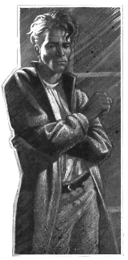

A portrait of Gabriel Knight, the protagonist of the series
{: .float}

"A mix of good mystery, writing and music," would be a correct answer. If you are thinking "What is a schattenjäger?" you will find the answer in the game series written by Jane Jensen. The first game, [*Sins of the Fathers*](http://www.mobygames.com/game/gabriel-knight-sins-of-the-fathers "Game information at MobyGames"), could not have appeared at a different time.

Published in 1993, it came at the end of the golden age of adventure games: targeting the broadest audience possible was not the priority and companies were spending on lavish productions (the package included a companion full-color comic book) even though the genre has a high cost of content creation (compared to laying new levels for first-person shooters).

The game was also notable for giving a serious treatment to serious subject matters and it expertly mixed the ingredients that would be flooding the popular media in the following years: a thrilling mystery with a touch of the paranormal, a flawed hero and a highly intelligent female character. (Incidentally, the first episodes of _X-Files_ were filmed the same year.) Although Jesnen did not trigger this "movement," she has a knack for staying ahead of her time. For example, the third installment dealing with the mystery of Rennes-le-Château[^note] was released four years before Dan Brown's _The Da&nbsp;Vinci Code_ dealing with the same subject.

[^note]: Popularized in the book _Holy Blood, Holy Grail_ which is the source for both Jensen's (credited) and Brown's (uncredited) story. The mystery in  _Holy Blood, Holy Grail_ was based on fabricated claims regarding Bérenger Saunière and the Priory of Sion.

Jensen's writing, including her intriguing manipulation of a well-researched history, is brought to life by the music composed by Robert Holmes which is another key ingredient completing the unique feel of the fictional world. Memorable motifs, powerful themes and intriguing variations form a varied, yet unmistakably unified whole. And because "talking about music is like dancing about architecture," let me close with some examples:

### Grace's Theme

This excerpt is from Grace's theme, as heard on a rare soundtrack CD. It features a typical piano work with notes accented by dynamics and pauses but has a more optimistic feel than is usual in the games.

<audio controls="controls">
    <source src="/assets/audio/grace_sample.mp3" type="audio/mpeg">
    <source src="/assets/audio/grace_sample.ogg" type="audio/ogg">
    Your browser does not support the HTML5 Audio element.
</audio>

### Gabriel's Theme

This is the title music and main theme taken from the CD version of _Sins of the Fathers_. Robert Holmes uses it in many variations and evolutions throughout the soundtrack.

<audio controls="controls">
    <source src="/assets/audio/gabriel_theme_sample.mp3" type="audio/mpeg">
    <source src="/assets/audio/gabriel_theme_sample.ogg" type="audio/ogg">
    Your browser does not support the HTML5 Audio element.
</audio>

### Fandango

The last sample is my favorite variation with a nice melancholy feeling.

<audio controls="controls">
    <source src="/assets/audio/fandango.mp3" type="audio/mpeg">
    <source src="/assets/audio/fandango.ogg" type="audio/ogg">
    Your browser does not support the HTML5 Audio element.
</audio>

 

There is a lot to like about this series. It is spanning the state of the art from hand-drawn, through full motion video to 3D; but the main reason to give it a try is if you like immersive stories and beautiful music.
