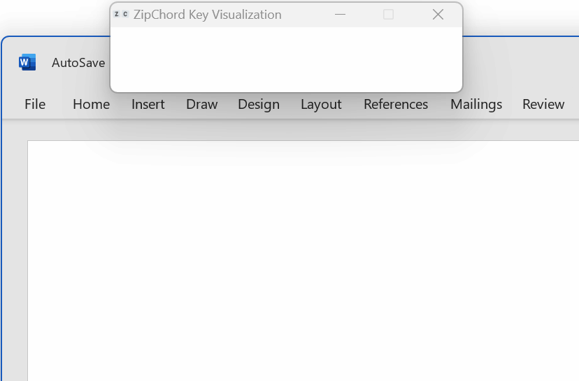

Thanks to Zipf’s law, it takes only a small number of chorded shortcuts to improve one half of all the typing we do.

Trained stenographers type at over 200 words per minute. This is possible because stenotype machines use chords of simultaneous key presses to input whole words at a time. Unsurprisingly, mastering this skill by learning the chords for all the words takes _years_.

> 40% of the total word count in _The Lord of the Rings_ consists of only 32 words.
{:.float}

But because languages follow Zipf’s law (the second most frequent word appears half as often as the first, the third appears one third as often as the first etc.) it turns out that half of all our written text is made out of just about 100 words. When I did a quick check on _The Lord of the Rings_, that number was 66 words.

What if you had a way to type those very frequent words really efficiently?

**A keyboard input that could accept normal typing as well as simple chords for a few dozen words would make a hugely disproportionate impact on the amount of typing.**

While there are software tools deditated to chorded entry, I could not find any tool or script that decently handles a hybrid of regular typing together with chords of two or more keys. Because I knew chorded entry would bring greater comfort and speed even if used for only a few words, I created _ZipChord_ and made it available for free.

# Benefits

ZipChord in action (visualizer shown for reference)
{: .float.edge}

_ZipChord_ allows you to mix regular typing with chorded key shortcuts to produce full words. It uses simple dictionaries with the list of chords and corresponding words and lets you define your own chords on the fly while you type. Thanks to Zipf's law, even a modest number of chords can replace a significant amount of typing. In addition, _ZipChord_ has a few more tricks that make typing easier:

## Shorthands

In addition to chords of simultaneous key presses and regular typing, _ZipChord_ supports 'shorthands' -- shortcuts that get expanded to full text when typed regularly. For example, by typing `qstn`, the output gets changed to 'question.'

## Smart Spaces

When mixing chords, normal typing, and shorthands, _ZipChord_ can insert and remove spaces as needed: When you enter a word using a chord, it will append a ‘smart space,’ so you are ready to start typing or chording the next word. But if the next thing you type is for example a comma, that extra space gets removed.

## Capitalization

_ZipChord_ can optionally also take care of capitalizing the chorded words and/or regular typing based on punctuation and new paragraphs.

## Chained Chords and More

Many words like ‘doing,’ ‘station’ or ‘sadly’ use suffixes, which appear frequently enough to benefit from being turned into their own chords which attach to preceding words, whether they were entered by typing or chording.

Chords and typing can also be chained to produce different text based on their sequence. For example, pressing P followed by a chord M+E could print out your phone number and A followed by M+E could or t your address.

Custom chords can be also useful for programmers, as you can easily define chords that produce blocks of code, with the caret moved to where you want to continue typing.

# That’s nice, but…

## …frequent words are short

It is true that the most frequent words tend to also be fairly short. In the text I analyzed, the average length of the top 100 words is 3.4 characters. Is the improvement offered by chords worth it?

To type the most frequent word in English (_the_), you need to press and release four keys in the correct sequence: `T`, `H`, `E`, and `Space`. To type it with _ZipChord_, you can press and release two keys simultaneously, and you can even place these keys conveniently on the home row.

Plus, entering whole words in one movement has a nice feel to it, which is another consideration on top of just speed.

## …you need to learn the shortcuts

Yes, unfortunately. The learning can be made easier by mapping the chords to letters that make up the words or by using some logical structure that makes sense to you personally. You can learn by following dynamically displayed hints, and either amuse an existing starting dictionary, or come up with your own chords.

Because of Zipf’s law, each lower-frequency word brings diminishing returns. This takes the pressure off learning many chords. Even a few can make your typing faster and more comfortable.

## …not everyone types in English

The statistics of Zip’s law are a actually quite universal across all languages. There isn’t anything in _ZipChord_ that is language specific.

## …it requires mental switching

This has been, in my experience, the biggest challenge. The more absorbed I get into something, the more often I forget to use chords where I could. The good news is that you may use as much or as little chords and shorthands as you like, because the tool is based around hybrid entry, so it gets out of your way.

## …sometimes it mistakes typing for a chord

If _ZipChord_ misinterprets your regular typing as chords, it is because two or more keys are being held down together too long. There are several ways to minimize this. By default, _ZipChord_ restricts chords once you start typing a word. You can also increase the chord detection delay, change a specific chord away from a problematic combination of keys, or adjust your typing form (I have a bad habit of balancing my laptop in my lap by lingering on the keys I already pressed).

## … not all keyboards support N-key rollover

Depending on the physical keyboard and the specific keys involved, the keyboard might not be sending all the simultaneous key presses to the computer.

While this limitation would be a blocker if your dictionary wants to replicate stenotyping, if the goal is to define shortcuts for up to a few hundred words, your chords can be easily limited to mostly two- and three-key chords. The vast majority of keyboards will process these chords correctly.

## … it only works on Windows

I have not explored how the tool could be adapted for MacOS, but the source code is open so anyone is welcome to adapt the programming logic for a MacOS version.

# Using ZipChord

With _ZipChord_, you can type using individual keystrokes as usual and combine them with defined 'chords' of several keys pressed at the same time and shorthands to enter whole words. And _ZipChord_ helps with smart spaces and capitalization as needed. To define your chords and shorthands, simply select the word you want to define and press and hold `Ctrl+C`.

Would you like to learn more about hybrid typing with ZipChord?

* Visit the [_ZipChord_ wiki](https://github.com/psoukie/zipchord/wiki),
* Or download and install the [latest release](https://github.com/psoukie/zipchord/releases). 

If you try _ZipChord_ or create a dictionary for it, I’d love to hear from you. Please leave a comment in the project's [discussion forum](https://github.com/psoukie/zipchord/discussions) or contact me on [LinkedIn](https://linkedin.com/in/psoukenik).